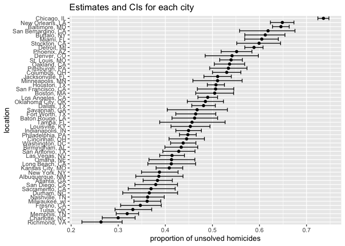
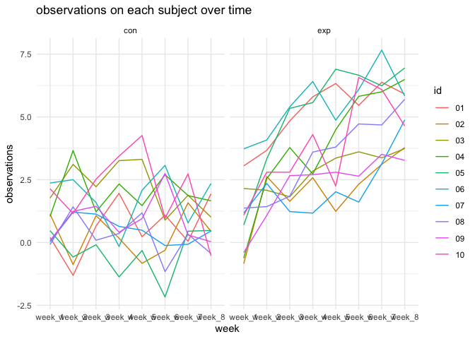
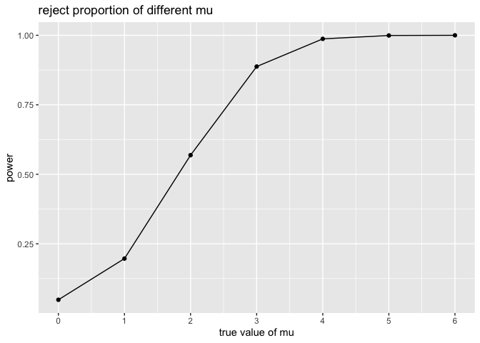
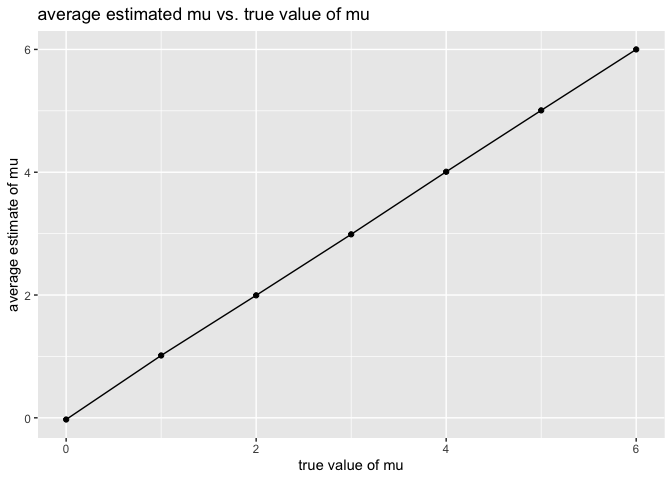
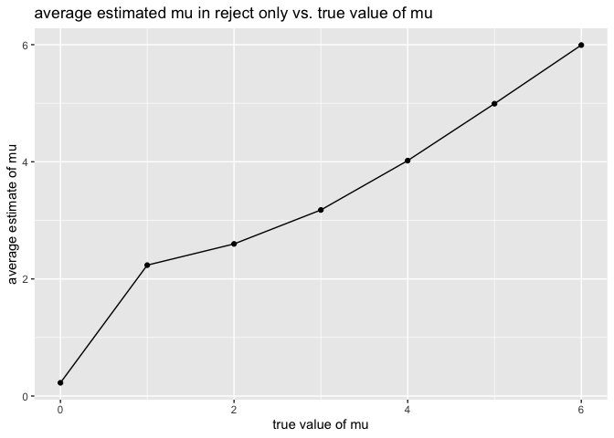

HW5
================
Ou Sha
2023-11-15

# Problem 1

``` r
# import data
homi <- read.csv("./data/homicide-data.csv")
```

The raw data has 52179 observations, and 12 variables, including the id
representing the case, victim’s name, race, age, and sex, the date and
the location of the case, and the status of the case.

``` r
# clean data 
homi <- homi|>
  # create city_state variable
  mutate(city_state = str_c(city, state, sep = ", "))|>
  mutate(reso = case_when(disposition == "Closed without arrest" ~ "unsolved",
                          disposition == "Open/No arrest"        ~ "unsolved",
                          disposition == "Closed by arrest"      ~ "solved"))|>
  filter(city_state != "Tulsa, AL")|>
  select(-city, - state, -disposition)
```

``` r
# summarize within cities to obtain the total number of homicides and umber of unsolved homicides
num_homi <- homi|>
  group_by(city_state)|>
  summarise(total_homi = n(), unsolved = sum(reso == "unsolved"))
num_homi
```

    ## # A tibble: 50 × 3
    ##    city_state      total_homi unsolved
    ##    <chr>                <int>    <int>
    ##  1 Albuquerque, NM        378      146
    ##  2 Atlanta, GA            973      373
    ##  3 Baltimore, MD         2827     1825
    ##  4 Baton Rouge, LA        424      196
    ##  5 Birmingham, AL         800      347
    ##  6 Boston, MA             614      310
    ##  7 Buffalo, NY            521      319
    ##  8 Charlotte, NC          687      206
    ##  9 Chicago, IL           5535     4073
    ## 10 Cincinnati, OH         694      309
    ## # ℹ 40 more rows

``` r
# use the prop.test function to estimate the proportion of homicides that are unsolved in Baltimore, md
md <- filter(num_homi, city_state == "Baltimore, MD")
md_test <- prop.test(pull(md, unsolved), pull(md, total_homi))
# save the output as an R object
save(md_test, file = "prop_test_result.RData")
# apply the broom::tidy to this object
md_test <- broom::tidy(md_test)
# pull the estimated proportion and confidence intervals
data.frame(city_state = "Baltimore, MD",
           estimated_prop = pull(md_test, estimate),
           confidence_interval = paste("(", pull(md_test, conf.low), ",",
                                       pull(md_test, conf.high), ")"))
```

    ##      city_state estimated_prop                       confidence_interval
    ## p Baltimore, MD      0.6455607 ( 0.627562457662644 , 0.663159860401662 )

``` r
# run prop.test for each of the cities
result <- num_homi|>
  mutate(test = map2(unsolved, total_homi, \(x,y)prop.test(x,y)),
         tidy = map(test, broom::tidy))|>
  unnest(tidy)|>
  #extract both the proportion of unsolved homicides and the confidence interval for each
  select(city_state, estimate, conf.low, conf.high)
result
```

    ## # A tibble: 50 × 4
    ##    city_state      estimate conf.low conf.high
    ##    <chr>              <dbl>    <dbl>     <dbl>
    ##  1 Albuquerque, NM    0.386    0.337     0.438
    ##  2 Atlanta, GA        0.383    0.353     0.415
    ##  3 Baltimore, MD      0.646    0.628     0.663
    ##  4 Baton Rouge, LA    0.462    0.414     0.511
    ##  5 Birmingham, AL     0.434    0.399     0.469
    ##  6 Boston, MA         0.505    0.465     0.545
    ##  7 Buffalo, NY        0.612    0.569     0.654
    ##  8 Charlotte, NC      0.300    0.266     0.336
    ##  9 Chicago, IL        0.736    0.724     0.747
    ## 10 Cincinnati, OH     0.445    0.408     0.483
    ## # ℹ 40 more rows

``` r
# create plot 
result|>
  # Organize cities according to the proportion of unsolved homicides
  ggplot(aes(x = estimate, y = reorder(city_state,estimate))) + 
  geom_point() + 
  geom_errorbar(aes(xmin = conf.low, xmax = conf.high))+
  labs(x = "proportion of unsolved homicides", y = "location", title = "Estimates and CIs for each city")
```

<!-- -->

Based on the plot, Richmond, VA has the smallest estimated proportion of
unsolved homicides and Chicago, IL has the largest estimated proportion
of unsolved homicides with a small CI.

# Problem 2

``` r
# create a tidy dataframe
p2 <- data.frame(name = list.files("./data/p2"), path= str_c("./data/p2/", list.files("./data/p2")))|>
  mutate(data = map(path, read.csv))|>
  unnest(c(data))|>
  separate(name, c("arm", "id"), "_")|>
  mutate(id = str_sub(id, start = 1, end = 2))|>
  select(-path)|>
  # switch from “wide” to “long” format
  pivot_longer(
    week_1:week_8,
    names_to = "week", 
    values_to = "observation")
# make spaghetti plot
p2|>
  ggplot(aes(x = week, y = observation, group = id, color = id)) +
  geom_line() +
  facet_grid(~arm)+
  labs(title = "observations on each subject over time",
       x = "week",
       y = "observations") +
  theme_minimal()
```

<!-- -->

The control group exhibited fluctuations around a constant value, while
the experimental group demonstrated an increasing trend as time
progressed.

# Problem 3

``` r
n <- 30
sigma <- 5
test_result <- NULL
# make function to generate 5000 data set
t_test <- function(m){
  for(i in 1:5000){
    x <- rnorm(n, m, sigma)
    test <- t.test(x, conf.level=0.95, mu = 0)
    test <- broom::tidy(test)
    test_result[[i]] <- tibble(set = i, m =m, mu_hat = pull(test, estimate), p_value = pull(test, p.value))
  }
  out <- bind_rows(test_result)
  return(out)
}
t_test(0)
```

    ## # A tibble: 5,000 × 4
    ##      set     m   mu_hat p_value
    ##    <int> <dbl>    <dbl>   <dbl>
    ##  1     1     0  1.54      0.180
    ##  2     2     0 -1.10      0.216
    ##  3     3     0 -0.262     0.745
    ##  4     4     0 -0.142     0.887
    ##  5     5     0 -0.871     0.457
    ##  6     6     0  0.00711   0.994
    ##  7     7     0 -0.923     0.338
    ##  8     8     0  0.769     0.320
    ##  9     9     0  0.439     0.704
    ## 10    10     0 -1.29      0.214
    ## # ℹ 4,990 more rows

``` r
# repeat for m = {1,2,3,4,5,6}
data <- NULL
for(i in 0:6){
  data <- bind_rows(data, t_test(i))
}
```

``` r
# Make a plot showing the proportion of times the null was rejected 
data|>
  group_by(m)|>
  summarise(rej_prop = sum(p_value<0.05)/5000)|>
  ggplot(aes(x = m, y = rej_prop))+
  geom_line()+
  geom_point()+
  labs(x = "true value of mu", 
       y = "power", 
       title = "reject proportion of different mu") +
  scale_x_continuous(breaks = seq(0, 6, 1))
```

<!-- -->

As true value of mu increase, the power (the reject proportion)
increases, and approaches to 1. There is a positive association between
effect size and power.

``` r
# Make a plot showing the average estimate of μ̂ 
total <- data|>
  group_by(m)|>
  summarise(avg_est = mean(mu_hat))
total|>
  ggplot(aes(x = m, y = avg_est))+
  geom_line()+
  geom_point()+
  labs(x = "true value of mu", 
       y = "average estimate of mu", 
       title = "average estimated mu vs. true value of mu")
```

<!-- -->

The average estimated mu is very close to the true value of mu. They
follow a linear relationship.

``` r
# Make a second plot (or overlay on the first) the average estimate of μ̂ only in samples for which the null was rejected
rej <- data|>
  group_by(m)|>
  filter(p_value<0.05)|>
  summarise(avg_est = mean(mu_hat))
rej|>
  ggplot()+
  geom_line(aes(x = m, y = avg_est))+
  geom_point(aes(x = m, y = avg_est))+
  labs(x = "true value of mu", 
       y = "average estimate of mu", 
       title = "average estimated mu in reject only vs. true value of mu")
```

<!-- -->

When mu is 4, 5, 6, the sample averages of estimated mu for which the
null is rejected are approximately equal to the true value of mu. This
could due to the small power and effect size when mu is from 0 to 3.
